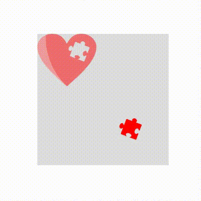
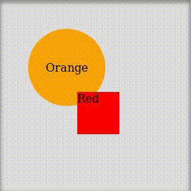
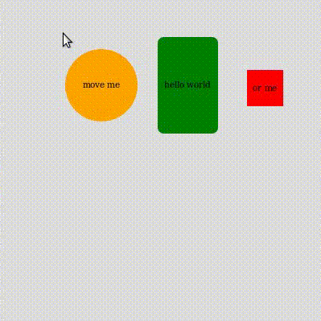

# @sasza/react-panzoom

[](https://www.npmjs.com/package/@sasza/react-panzoom)
[](https://www.npmjs.com/package/@sasza/react-panzoom)
[](https://bundlephobia.com/package/@sasza/react-panzoom)
[](LICENSE)

> A React component for **pan & zoom** with first-class support for **moving**, **resizing** and **selecting** elements inside the viewport.



Built on top of [`panzoom-core`](https://www.npmjs.com/package/panzoom-core), a lightweight, framework-agnostic pan & zoom engine.

## Features

- 🖐️ **Pan** with mouse drag or touch
- 🔍 **Zoom** with the wheel or pinch gestures
- 🧲 **Movable elements** with families & followers for grouped dragging
- ↔️ **Axis locking** — restrict element movement to horizontal or vertical only
- 📐 **Resizable elements** (horizontal and/or vertical)
- 🎯 **Selecting mode** for marquee-selecting multiple elements
- 🧱 **Boundaries** with support for dynamic expressions
- 🖼️ **`PanZoomWithCover`** for panning/zooming over a background image
- 🚀 **Auto-move at edge** while dragging near the viewport border
- 📦 Ships ESM + CJS + TypeScript types

## Demos

| Demo | Link |
| --- | --- |
| Basic | https://codesandbox.io/s/goofy-rgb-48tbu |
| Map with background image | https://codesandbox.io/s/bold-pond-v0kvx7 |
| Example from preview | https://codesandbox.io/s/loving-lederberg-r75ufe |

**Built on `@sasza/react-panzoom`:** [react-drawing](https://www.npmjs.com/package/react-drawing)

## Installation

```bash
npm install @sasza/react-panzoom
# or
pnpm add @sasza/react-panzoom
# or
yarn add @sasza/react-panzoom
```

## Quick start

```jsx
import PanZoom from '@sasza/react-panzoom'

const App = () => (
  <PanZoom>
    Lorem ipsum dolor
  </PanZoom>
)
```

## Options

Pass these as props to `<PanZoom>`.

| Name | Type | Default | Description |
| --- | --- | --- | --- |
| `boundary` | `{ top, right, bottom, left }` \| `boolean` | `false` | Restrict panning. Values are numbers in px, or expressions like `{ top: 'childHeight - containerHeight - 100px' }`. Pass `true` to clamp to the child bounds. |
| `children` __*__ | `node` | | |
| `className` | `string` | `undefined` | Custom class name applied to the container. |
| `disabled` | `bool` | `false` | Disable pan **and** zoom. |
| `disabledElements` | `bool` | `false` | Disable moving of all elements. |
| `disabledMove` | `bool` | `false` | Disable panning (zoom still works). |
| `disabledScrollHorizontal` | `bool` | `false` | Disable horizontal panning. |
| `disabledScrollVertical` | `bool` | `false` | Disable vertical panning. |
| `disabledUserSelect` | `bool` | `false` | Prevent text/CSS selection while interacting. |
| `disabledZoom` | `bool` | `false` | Disable zooming. |
| `elementsAutoMoveAtEdge` | `bool` | `false` | Auto-pan the viewport when dragging an element near the edge. |
| `height` | `string`/`number` | `100%` | Height of the child container. |
| `onContainerChange` | `func` | `null` | Fired on move **or** zoom. Receives `{ position, zoom }`. |
| `onContainerClick` | `func` | `null` | Fired on mousedown/touchstart. Receives `{ e, stop, x, y }`. Same trigger as `onContainerPressStart`. |
| `onContainerPressStart` | `func` | `null` | Fired on mousedown/touchstart. Receives `{ e, stop, x, y }`. |
| `onContainerPressEnd` | `func` | `null` | Fired on mouseup/touchend/touchcancel. Receives `{ e, x, y }`. |
| `onContainerPositionChange` | `func` | `null` | Fired on position change. Receives `{ position, zoom }`. |
| `onContainerZoomChange` | `func` | `null` | Fired on zoom change. Receives `{ position, zoom }`. |
| `onContextMenu` | `func` | `null` | Fired on right click. Receives `{ e, x, y }`. |
| `onElementsChange` | `func` | `null` | Fired when any element changes position. Receives a map of `{ [id]: { x, y } }`. |
| `scrollSpeed` | `number` | `1` | Panning speed multiplier. |
| `selecting` | `bool` | `false` | Switch to marquee selecting mode. See [Selecting](#selecting). |
| `width` | `string`/`number` | `100%` | Width of the child container. |
| `zoomInitial` | `number` | `1` | Initial zoom value. |
| `zoomMax` | `number` | `5` | Maximum zoom. |
| `zoomMin` | `number` | `0.3` | Minimum zoom. |
| `zoomPosition` | `{ x, y }` \| `null` | `null` | Anchor point for zooming. `x`/`y` are numbers or `'center'`. |
| `zoomSpeed` | `number` | `1` | Zoom speed on wheel events. |

__*__ required

### Boundary expressions

`boundary` accepts plain px numbers, or string expressions built from a small set of variables and the `+` / `-` operators. This is useful when the boundary should depend on the size of the container or the child content:

```jsx
<PanZoom
  boundary={{
    top: 0,
    left: 0,
    right: 'childWidth - containerWidth',
    bottom: 'childHeight - containerHeight - 100px',
  }}
>
  Lorem ipsum dolor
</PanZoom>
```

Available variables:

| Variable | Meaning |
| --- | --- |
| `containerWidth` | Width of the container (viewport). |
| `containerHeight` | Height of the container (viewport). |
| `childWidth` | Width of the panned child content. |
| `childHeight` | Height of the panned child content. |

> Only `+` and `-` are supported, and numbers may carry a `px` suffix (e.g. `'childWidth - 100px'`). Passing `boundary={true}` clamps panning to the child bounds automatically.

## API

```jsx
import { useRef } from 'react'
import PanZoom, { API } from '@sasza/react-panzoom'

const panZoomRef = useRef<API>()

const App = () => (
  <PanZoom ref={panZoomRef}>
    Lorem ipsum dolor
  </PanZoom>
)
```

`panZoomRef.current` exposes:

| Method | Description |
| --- | --- |
| `move(x, y)` | Add `x`/`y` (px) to the current offset. |
| `getElements()` | Return the map of registered elements. |
| `getElementsInMove()` | Return the elements currently being dragged. |
| `grabElement(id, position?)` | Programmatically start dragging an element. Returns a release fn (or `null`). |
| `updateElementPosition(id, position)` | Move an element and fire change events. |
| `updateElementPositionSilent(id, position)` | Move an element **without** firing change events. |
| `goBackToBoundary()` | Snap the viewport back inside the configured boundary. |
| `getPosition()` → `{ x, y }` | Return the current pan offset. |
| `setPosition(x, y)` | Set the pan offset. |
| `getZoom()` → `number` | Return the current zoom. |
| `setZoom(zoom)` | Set the zoom. |
| `zoomIn(zoom)` | Add to the current zoom (negative values zoom out). |
| `zoomOut(zoom)` | Subtract from the current zoom. |
| `childNode` | The panned/zoomed child node. |
| `reset()` | Reset position and zoom to `(0, 0, 0)`. |

## Elements



```jsx
import PanZoom, { Element } from '@sasza/react-panzoom'

// ...

<div style={{ width: 300, height: 300 }}>
  <PanZoom>
    <Element id="orange" x={50} y={60}>
      <Circle />
    </Element>
    <Element id="red" x={120} y={150}>
      <Square />
    </Element>
  </PanZoom>
</div>
```

### Element properties

| Name | Type | Default | Description |
| --- | --- | --- | --- |
| `id` __*__ | `string`/`id` | `undefined` | Unique ID of element. |
| `children` __*__ | `node` | | |
| `className` | `string` | `undefined` | Class name for element. |
| `disabled` | `bool` | `false` | Disabling element. |
| `disabledMove` | `bool` | `false` | Disabling move of this element. |
| `disabledMoveHorizontal` | `bool` | `false` | Lock movement on the X axis (only vertical dragging allowed). |
| `disabledMoveVertical` | `bool` | `false` | Lock movement on the Y axis (only horizontal dragging allowed). |
| `draggableSelector` | `string` | `undefined` | Selector for dragging element. |
| `family` | `string` | `undefined` | Name of element's family, all of elements are connected during moving. |
| `followers` | `Array<string/id>` | `[]` | Similar to family, but for specified ids of elements. |
| `onClick` | `func` | `null` | Event on clicking at element. |
| `onContextMenu` | `func` | `null` | Event on right click at element. |
| `onMouseUp` | `func` | `null` | Event on mouse up after clicking at element. |
| `x` | `number` | `0` | x position of element. |
| `y` | `number` | `0` | y position of element. |
| `width` | `number` | `undefined` | Element width in px. |
| `height` | `number` | `undefined` | Element height in px. |
| `zIndex` | `number` | `undefined` | Fixed z-index. When omitted, the element is auto-raised on drag. |

#### Resizing

| Name | Type | Default | Description |
| --- | --- | --- | --- |
| `resizable` | `bool` | `false` | Enable horizontal resizing. |
| `resizerWidth` | `number` | `15` | Width of the horizontal resize handle. |
| `resizedMinWidth` | `number` | `15` | Minimum width when resizing. |
| `resizedMaxWidth` | `number` | `undefined` | Maximum width when resizing. |
| `resizableVertical` | `bool` | `false` | Enable vertical resizing. |
| `resizerHeight` | `number` | `15` | Height of the vertical resize handle. |
| `resizedMinHeight` | `number` | `15` | Minimum height when resizing. |
| `resizedMaxHeight` | `number` | `undefined` | Maximum height when resizing. |
| `onStartResizing` | `func` | `null` | Fired when resizing begins. Receives `{ id }`. |
| `onAfterResize` | `func` | `null` | Fired when resizing ends. Receives `{ id }`. |

__*__ required

### Locking movement to a single axis

Use `disabledMoveHorizontal` / `disabledMoveVertical` to constrain how an element can be dragged — handy for sliders, timelines or lanes.

```jsx
// Element can only move up and down
<Element id="vertical-slider" disabledMoveHorizontal><Circle /></Element>

// Element can only move left and right
<Element id="horizontal-slider" disabledMoveVertical><Circle /></Element>
```

### Family vs followers

Both group elements so they move together, but they express the relationship differently:

- **`family`** — a shared, symmetric group name. Dragging **any** element in the family moves **all** of them. Great for clusters that should always travel together.
- **`followers`** — a directed, one-way list of IDs on a single element. Dragging that element also moves its followers, but dragging a follower on its own does **not** move the leader.

```jsx
// Symmetric group — drag any of them, all move
<Element id="a" family="group-1"><Circle /></Element>
<Element id="b" family="group-1"><Square /></Element>

// One-way — dragging 'leader' also moves 'child-1' and 'child-2',
// but dragging 'child-1' alone moves only itself
<Element id="leader" followers={['child-1', 'child-2']}><Circle /></Element>
<Element id="child-1"><Square /></Element>
<Element id="child-2"><Square /></Element>
```

## Selecting

```jsx
import PanZoom, { Element } from '@sasza/react-panzoom'

// ...

<div style={{ width: 300, height: 300 }}>
  <PanZoom selecting>
    <Element id="orange" x={50} y={60}>
      <Circle />
    </Element>
    <Element id="red" x={120} y={150}>
      <Square />
    </Element>
    <Element id="green" x={200} y={50}>
      <SquareRounded />
    </Element>
  </PanZoom>
</div>
```



## PanZoomWithCover

Pan & zoom over a background image, automatically scaled and clamped to the image bounds.

```jsx
import { PanZoomWithCover } from '@sasza/react-panzoom'

const App = () => (
  <PanZoomWithCover cover="url_to_image">
    Lorem ipsum dolor
  </PanZoomWithCover>
)
```

`PanZoomWithCover` accepts the same [options](#options) as `PanZoom` (except `boundary`, which is managed internally), plus:

| Name | Type | Default | Description |
| --- | --- | --- | --- |
| `cover` __*__ | `string` | `undefined` | URL of the background image. |
| `onCoverLoad` | `func` | `undefined` | Fired once the image has loaded and the component is initialized. |

__*__ required

## TypeScript

The package ships with full type definitions — no `@types` package required. The public entry exports `API`, `ElementOptions` and `PanZoomOptions`:

```tsx
import PanZoom, { API, ElementOptions, PanZoomOptions } from '@sasza/react-panzoom'
import { useRef } from 'react'

const panZoomRef = useRef<API>()
const options: PanZoomOptions = { zoomMin: 0.5, boundary: true }

const App = () => (
  <PanZoom ref={panZoomRef} {...options}>
    Lorem ipsum dolor
  </PanZoom>
)
```

## Development

```bash
pnpm i        # install dependencies
pnpm dev      # run the interactive examples (Ladle)
pnpm test     # run the test suite (Vitest)
pnpm build    # build the library
pnpm lint     # lint & auto-fix
```

## License

[MIT](LICENSE) © sasza
</content>
</invoke>
